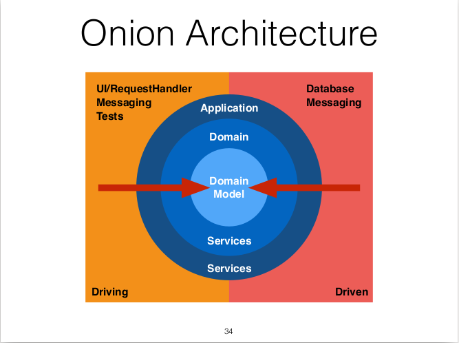

= Bausteinsicht

== Grobe Übersicht

Unsere Anwendung besteht aus drei elementaren Schichten: +
Model , Services und infrastructure. +
In der infrastructure-Schicht befinden sich im wesentlichen Controller, die Anfragen über den Webbrowser entgegennehmen.
In der Services-Schicht befinden sich verschidene Services, die in den Controller benutzt werden und verschiedene Dienste leisten.
In der Model-Schicht befinden sich unsere Anwendungsobjekte,die die grundliegende Komponente unseres Projektes realisieren. +

