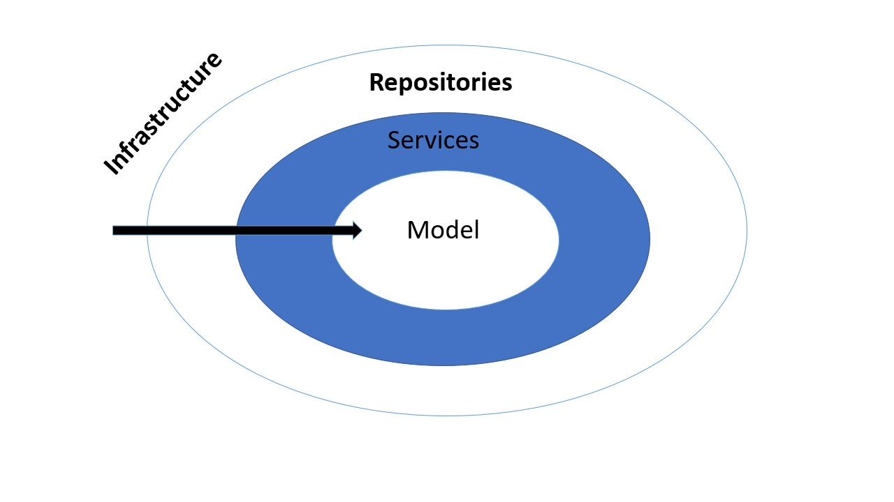

= Bausteinsicht

== Grobe Übersicht

Unsere Anwendung besteht aus drei elementaren Schichten: Model, Services und Infrastructure.

- In der Infrastructure-Schicht befinden sich im Wesentlichen Controller, die Anfragen über den Webbrowser entgegennehmen.
- In der Services-Schicht befinden sich verschiedene Services, die in den Controllern benutzt werden und verschiedene Dienste leisten.
- In der Model-Schicht befinden sich unsere Anwendungsobjekte, die die grundlegende Komponente unseres Projektes realisieren.

== Post-Anfragen

Im Falle von Post-Anfragen bzw. Formularen wandelt der Controller die Formulardaten in Objekte des Modells um.
Diese Objekte werden falls nötig von den Services weiter verarbeitet und schließlich von dem entsprechenden Repository in
die Datenbank gespeichert.

== Get-Anfragen

Im Falle von Get-Anfragen wandelt der Controller mit Hilfe von Thymeleaf die Objekte des Modells in HTML-Darstellungen um.
Diese Objekte erhält der Controller wiederum durch Anfragen auf die Services oder direkt auf die Repositories, welche die Daten beispielsweise aus der Datenbank holen oder aus dem Datenbestand generieren. +

== Bildliche Darstellung

