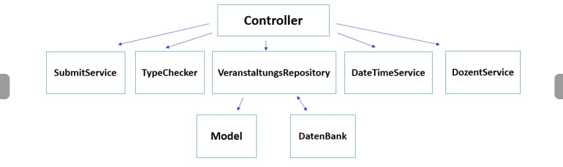

= Laufzeitsicht

Die während der Laufzeit benötigten Daten werden den Views von den zuständigen Controllern übergeben.
Diese greifen wiederum auf die jeweiligen Services bzw. Repositories zu,
welche für die Logik und das Holen der gefragten Daten zuständig sind.

Im Folgenden werden ein paar beispielhafte Laufzeit-Interaktionen skizziert, um dies beispielhaft zu verdeutlichen.

=== _Feedback geben_

* Damit Studierende unser Subsystem nutzen können, müssen sie sich als erstes anmelden.
Dies geschieht durch die Anmeldungsseite von Keycloack.

* Nach der erfolgeichen Anmeldung wird der Student bzw. die Studentin auf die Übersichtsseite der Studierende weitergeleitet,
wo sie alle Veranstaltungen, die sie besuchen, sehen können.

* Der Student oder die Studentin kann sich dann aussuchen, für welche Veranstaltung das Feedback abgegeben werden soll.
Durch das Klicken auf die gesuchte Veranstaltung, holt der Controller aus dem VeranstaltungsRepository alle Fragebogen, die man ausfüllen darf.
Dies geschieht mit Hilfe von SubmitService, um zu vermeiden, dass ein Student oder eine Studentin mehrfach das gleiche Fragebogen ausfüllt.

* Der von den Dozenten festgelegten Zeitraum wird mit Thymeleaf und JavaScript gezeigt.
Die Abgabe eines Feedbacks erfolgt nur in dem entsprechenden Zeitraum, Da nach dem Ablauf der festgelegten Frist wird der Zugriff auf das Fragebogen deaktiviert.

* Klickt man auf das gewünschte Fragebogen, werden von dem Controller alle Fragen geholt, die zu dem Fragebogen gehören.

* Nach dem ausfüllen des Fragebogens kann der Student oder die Studentin das Fragebogen durch Klicken auf den "Abgeben" Button speichern.
Das Persistieren der Antwoten auf das Fragebogen ist anonym. Das heißt, es wird nicht gespeichert, wer welche Antworten abgegeben hat.
